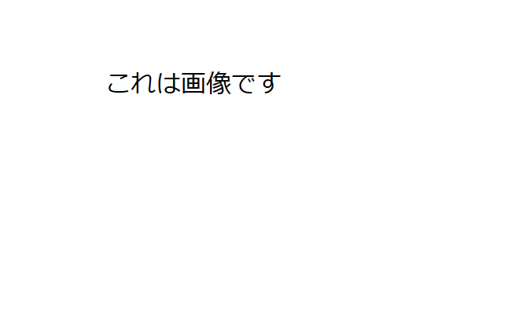

# マークダウンの例

## 見出しの書き方

```md
# + 半角スペース から行を始めると、見出しになります。
```

### 「#」の数で見出しのレベルが決まります。

#### 4番目の見出し

___見出しの後には1行空行が必要です___

## リスト(箇条書き)の書き方

* アスタリスク「*」 + 半角スペースで 順序無しリストになります。
* 2番目の要素
* 3番目の要素

1. 数字 + 「.」 + 半角スペース で 順序有りリストになります。
1. 2番目の要素
1. 3番目の要素

ビューアーによりますが、
大体の場合自分で番号を振らなくても、
「1.」を続ければ、勝手に採番してくれます。

## 画像の埋め込み方

下記のように書きます。



```md

```

大体の場合URLは`file:///`から始めなくても、
相対パスなら大丈夫です。

## ソースコード片の埋め込み方

インラインで埋め込む場合、Back Tick で囲みます。
`var a = 10;` こんな感じです。

複数行になる場合はBack Tick を3つ続けて囲みます。

```cpp
// これはソースコードです
```

埋め込むソースコードの言語を指定する場合は
バックチックの後に書きます。

```python
def func():
    pass
```

```csharp
class X
{
    X()
    {
    }
}
```

解釈可能な言語は、ビューアーによって異なります。


## 強調表示

**アスタリスク2つで囲んだ場合、BOLDになります**
__アスタリスクの代わりに、アンダーバーでも大丈夫です__

_アスタリスク、アンダーバー1つの場合はイタリックになります。_

___三つで囲むとBold + Italicになります。___

これも表示のされ方はViewerに依存します。

## テーブル

あまり使いませんが、テーブルもかけます。

